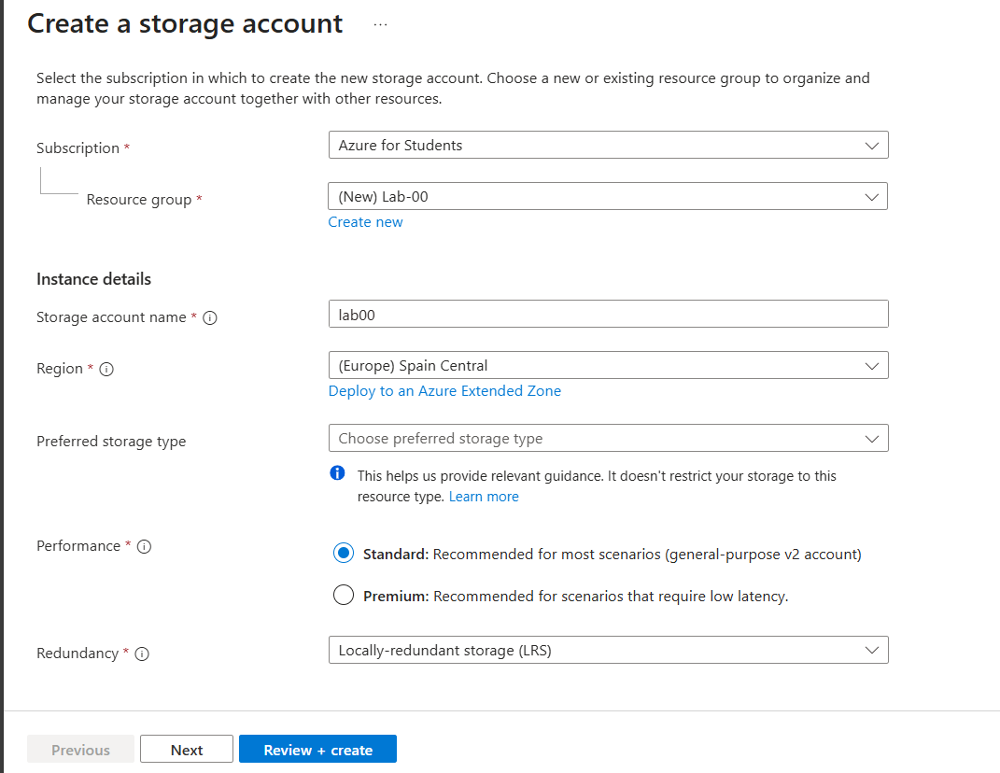
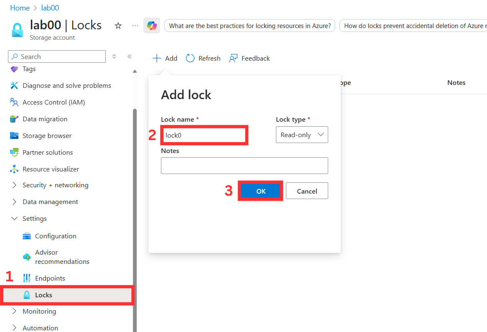
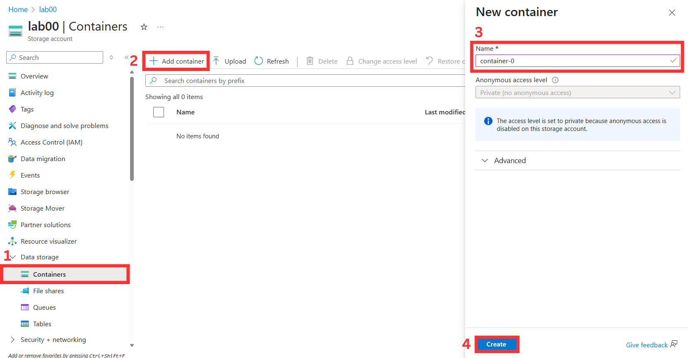
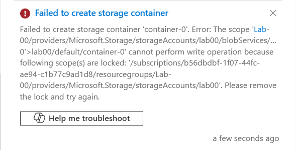
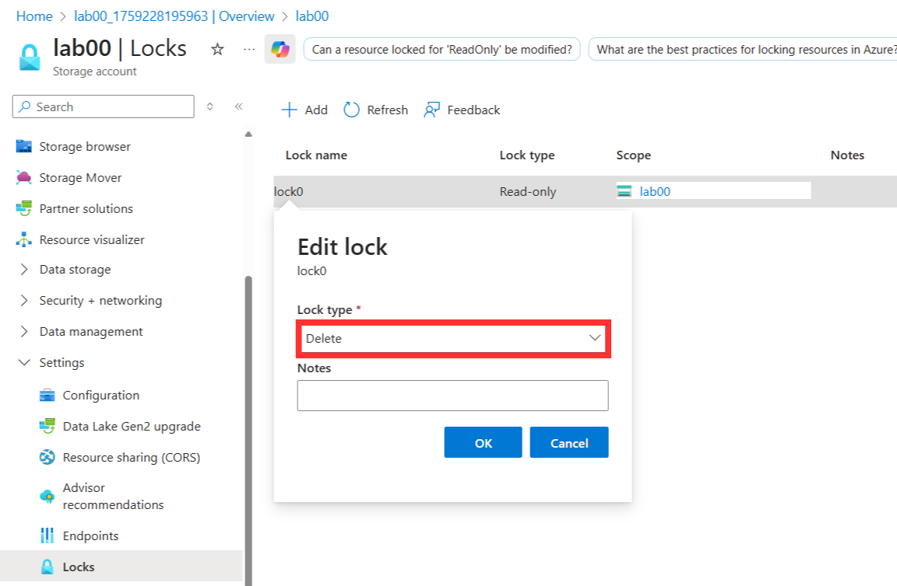
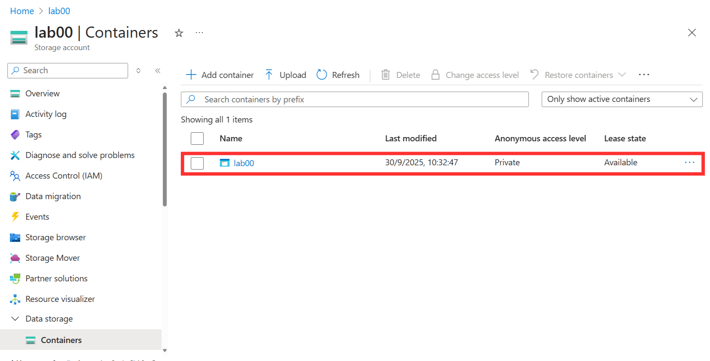
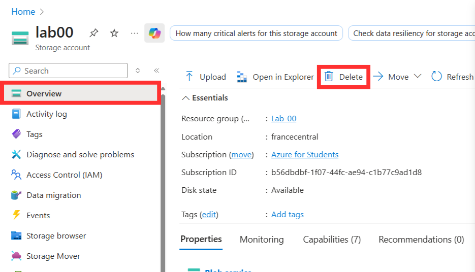
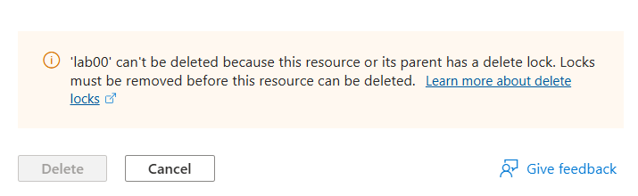
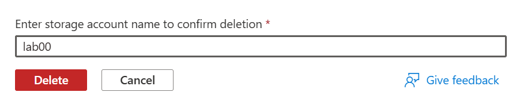
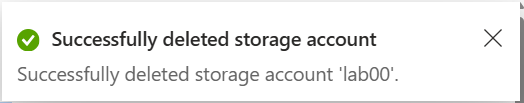

# Exercise - Configure a resource lock

This exercise demonstrates how to create a resource in Azure and configure a resource lock. A storage account is used as an example since it provides one of the clearest ways to observe the impact of locks.

> [!IMPORTANT]
> You will need an Azure Subscription

## Task 1: Create a resource

Before applying a resource lock, an Azure resource must exist. In this case, the resource will be a storage account.

1. Sign in to the Azure portal at [https://portal.azure.com](https://portal.azure.com).
2. Select **Create a resource**.
3. Under **Categories**, choose **Storage**.
4. Select **Storage Account** → **Create**.
5. On the **Basics** tab, complete the following fields (leave defaults for the rest):

   | Setting              | Value                                 |
   |----------------------|---------------------------------------|
   | Resource group       | Create new                            |
   | Storage account name | Provide a unique name                 |
   | Location             | Choose an available region            |
   | Performance          | Standard                              |
   | Redundancy           | Locally redundant storage (LRS)       |

> [!NOTE]
> If you encounter a region error change the region until you find one that works.

6. Select **Review + Create** and then **Create**.
7. Once deployment completes, select **Go to resource**.

## Task 2: Apply a read-only resource lock

Next, a read-only lock is applied to the storage account.

1. In the left-hand menu, scroll down to **Settings**.
2. Select **Locks** → **+ Add**.
3. Enter a name for the lock.
4. Set **Lock type** = **Read-only**.
5. Select **OK**.

## Task 3: Add a container to the storage account

The next step is to try adding a container to see the effect of the lock.

1. Under **Data storage**, select **Containers**.
2. Select **+ Container**.
3. Enter a container name → **Create**.

An error message will appear:

This occurs because the **read-only lock** blocks any create or update operations.

## Task 4: Modify the resource lock and create a storage container

To proceed, the lock type must be changed.

1. Go back to **Settings > Locks**.
2. Select the existing lock and change **Lock type** → **Delete** → **OK**.

3. Return to **Data storage > Containers**.
4. Select **+ Container**, enter a name → **Create**.

You should now be able to see the created container.

## Task 5: Delete the storage account

Now, attempt to delete the storage account.

1. Go to the **Overview** page.
2. Select **Delete**.

A notification will appear:

## Task 6: Remove the delete lock and delete the storage account

Finally, the delete lock is removed and the storage account is cleaned up.

1. Go to **Settings > Locks**.
2. Remove the existing delete lock.
3. Navigate back to **Home > Storage accounts**.
4. Select the storage account → **Delete**.
5. Confirm by typing the storage account name and select **Delete**.

A confirmation message should appear, confirming the storage account was deleted:

## Congratulations!

This exercise walked through the full process of creating a resource, applying a lock, testing its restrictions, modifying it, and finally removing it to delete the resource.

> [!WARNING]
Be sure to complete Task 6 and remove the storage account. Users are responsible for any resources in their Azure subscription, so it’s essential to clean up after completing the exercise.
